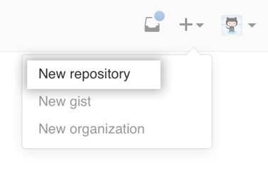
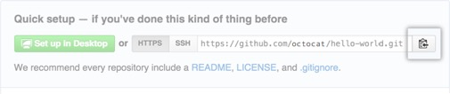
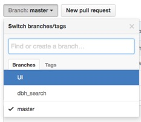

# Guide to GitHub (for Mac Users)

Git is a revision control system used to manage source history, and GitHub is a hosting service for Git repositories. 
Below is a guide for Mac users to Git and GitHub, and has been adapted from the content found on [GitHub Help](https://help.github.com/), the Help section of the GitHub website.

Please note the following:
> 
In this guide, the instruction "Run`sample_command`" refers to pasting `sample_command`into your Terminal and pressing the enter key, so as to run that command. 

> The term **local repository** refers to the copy of your project that is stored on your computer, and the term **remote repository** refers to the copy on the GitHub website.   

> To **clone** a remote repository is to create a local copy in which you can make your changes. If you are granted access by the author, you can push changes of your own to the remote repository as well.

## Setting Up a GitHub Account

### Create a GitHub Account

1. Go to [https://github.com/](https://github.com/)
2. Click **Sign up**.
3. Under **Create your personal account**, type your username, email address, and password, then click **Create an account**.
4. Select the **Free** account type.
5. Click **Finish sign up**.

### Check for existing SSH keys

1. In your Terminal, run`ls -al ~/.ssh` to see if existing SSH keys are present.
This will list the files in your`.ssh`directory, if they exist.
2. Check the directory listing to see if you already have a public SSH key. By default, the filenames of the public keys are one of the following:

	* 	 `id_dsa.pub`
	* 	` id_ecdsa.pub`
	* 	`id_ed25519.pub`
	* 	`id_rsa.pub`

3. If you don't have an existing public and private pair key or you don't wish to create one of the existing ones, generate a new SSH key.
4. Otherwise, you can add your SSH key to the ssh-agent.

### Generate a new SSH key and add it to the SSH-agent

1. Run the following, substituting your GitHub email address within the quotations:   
`ssh-keygen -t rsa -b 4096 -C "your_email@example.com"`  
This creates a new ssh key, using your email as a label.

2. When you're prompted to "Enter a file in which to save the key," press Enter, to accept the default file location
`Enter a file in which to save the key (/Users/you/.ssh/id_rsa): [Press enter]`

### Add your SSH key to the ssh-agent

1. Run`eval "$(ssh-agent -s)"`  
This starts the ssh-agent.  

2. Run `ssh-add ~/.ssh/id_rsa`  
This adds your SSH key to the ssh-agent.

### Add a new SSH key to your GitHub account

1. Run `pbcopy < ~/.ssh/id_rsa.pub`  
This copies the SSH key to your clipboard.
2. In the top right corner of any page, click your profile image, then click **Settings**.
3. In the user settings sidebar, click **SSH and GPG keys**.
4. Click **New SSH key**.

## Creating a New Git Repository

Click <a href="#create-new-git-repo-on-github">here</a> to create a brand new repository on GitHub that you can then clone onto your computer, or click <a href="#add-existing-project-to-github">here</a> to create a Git repository from an existing project on your computer.

For instructions on cloning another user's repository, click <a href="#clone-repository-locally">here</a>.

<h3 id="create-new-git-repo-on-github">
Create a new Git repository on GitHub
</h3>

1. Sign into [https://github.com/](https://github.com/)
2. Click on the plus sign in the top right corner and click on **New Repository**. 

3. Enter a short name for the new repository. You can optionally add a short description as well.
4. Choose between a **public** and **private** repository (if you have set up a free account, click on **Public**).
5. If you would like to create a README, check the box that says **Initialize this repository with a README**.
6. Select  **Create Repository**.  
You will be directed to the page https://github.com/your\_username/your\_repo\_name.
5. Next, clone the repository onto your computer. (Click <a href="#clone-repository-locally">here</a> for instructions and start at step 2.)  
This will create a copy of the new repository on your computer. 
6. To verify the remote URL, click <a href="#verify-remote-url">here</a>.

Congratulations! You have created a new repository. Add new files to the new folder on your computer. To add and commit files, click <a href="#make-changes-and-commit-them">here</a>. To add collaborators, click <a href="#add-collaborators">here</a>.

<h3 id="add-existing-project-to-github">Add an existing project to GitHub</h3>

1. In the Terminal,`cd`into the directory that contains your project. For example, if your project directory`my-project` is on your Desktop, run`cd ~/Desktop/my-project`
2. Run`git init`  
This creates a Git repository named`my-project`from the local directory.  
3. Create a new repository in GitHub (click <a href="#create-new-git-repo-on-github">here</a> for instructions), ideally with the same name as the project directory.
4. At the top of your GitHub repository’s **Quick Setup** page, click on the clipboard icon to copy the remote repository URL. 

5. In your Terminal, run`git remote add origin your_repository_url`  
This sets the remote, i.e. the URL to which your local repository will be pushed.
6. To verify the remote URL, click <a href="#verify-remote-url">here</a>.
7. Next, add and commit files. (Click <a href="#make-changes-and-commit-them">here</a> for instructions.)
8. Run`git push -u origin master`   
This pushes the changes in your local repository to the remote repository on GitHub.

<h3 id="add-collaborators">
Add collaborators
</h3>

1. Click on the repository in GitHub. You should now be at the following url:  
https://github.com/your\_username/your\_repo\_name
2. Click on the **Settings** link on the right half of the page.  
	 
3. This will take you to a new page. Click on the **Collaborators** tab in the sidebar on the left, and start typing the collaborator’s username.  

4. Select the collaborator’s username from the dropdown menu, and click on **Add collaborator**.
5. The user will receive an email invitation to your repository. Once the user clicks on the **Verify your email address** link in this email invitation and verifies their email address, they will get collaborator access.

Your collaborators can clone your remote repository on their respective computers (click <a href="#clone-repository-locally">here</a> for instructions).

<h3 id="verify-remote-url">Verify the remote URL</h3>
1. To verify the new remote URL, run`git remote -v`  
You should see the following:
<pre>
origin your\_repository\_url (fetch)
origin your\_repository\_url (push)
</pre>
That is, if user **xyz123** has created a repository **hello-world**, the output would look like this:
<pre>
origin https://github.com/xyz123/hello-world.git (fetch)
origin https://github.com/xyz123/hello-world.git (push)
</pre>

<h3 id="clone-repository-locally">Clone the repository locally</h3>
1. Go to https://github.com/author-username/project-name, substituting "author-username" with the username of the project's author, and "project-name" with the repository's name
2. In the Terminal,`cd`into the directory inside which you would like to clone the repository. For example, to clone the repository on your Desktop, enter`cd ~/Desktop`
3. Under the repository name, click **Clone or Download**.  

4. Under **Clone with HTTPS**, click the clipboard icon to copy the URL for the repository  

5. Run `git clone your_repository_url`  
This will create a copy of the project on your computer.

### Configure your username and email address
1. If at any point you get the message "Please tell me who you are", enter the following:
<pre>
git config --global user.name "your user name"
git config --global user.email "your email address"
</pre>

## Contributing to the Repository

<h3 id="create-new-branch">Create a new branch to make changes in</h3>
1. In the Terminal, `cd` into your local repository.
2. Run`git branch`  
You will see `* master` in the output, because you are in the master branch.
3. The next step is to create a new branch so you can make changes without touching the original version in the master branch.  
Run`git branch your-branch-name`  
This creates a new branch with the name your-branch-name.
5. Run`git checkout your-branch-name`  
This switches you to the new branch, and you can start making changes.

<h3 id="make-changes-and-commit-them">Make changes and commit them</h3>
1. Work on your code and save your changes.
2. In the Terminal,`cd`into the repository.
3. Run`git status`  
You will see a list of files that have been modified.
4. For each of the files whose changes you would like to track, run `git add file_name`  
Alternately, to add all files that appear in the output of Step 3, you can run `git add .` (with the period)
5. Run `git commit -a -m "Your commit message"`  
This will commit your changes within your branch.  
6. Click <a href="#push-changes-to-your-branch-in-remote-repo">here</a> to push your local changes to your branch in the remote repository.

<h3 id="push-changes-to-your-branch-in-remote-repo">Push your changes to your branch in the remote repository</h3>
1. Run`git push -u origin your-branch-name`  
Now, your collaborators can view the work you have done in your branch by opening the remote repository on GitHub.
2. Click on the **Branch** tab on the left side of the page to access the version of the code stored in a particular branch.  

3. Once you have made more changes that you would like to commit to your branch in the remote repository, go back to <a href="#make-changes-and-commit-them">this step</a> and repeat.
4. Once you are ready to get feedback from your collaborators, click <a href="#make-a-pull-request">here</a> to create a pull request.

<h3 id="make-a-pull-request">Make a pull request</h3>
1. From the GitHub website, submit a pull request for `your_branch_name`
Collaborators can now make comments on your code.  
2. Make further changes as needed.
3. Repeat <a href="#make-changes-and-commit-them">this step</a> to commit your changes.
4. Repeat <a href="#push-changes-to-your-branch-in-remote-repo">this step</a> to push them to the remote branch.
3. Once the code has been accepted, click <a href="#update-your-local-master-branch">here</a> to merge your changes into your local and remote master branch.

<h3 id="update-your-local-master-branch">Update your local master branch to reflect changes made by collaborators</h3>
1. In the Terminal, `cd` into your project folder.
2. Run`git checkout master`  
This switches you to the master branch if you are not in it already.
3. Run`git fetch origin`
4. Run`git merge --ff-only origin/master`
5. Click <a href="#rebase-and-merge-your-changes">here</a> to merge your changes.

<h3 id="rebase-and-merge-your-changes">Rebase and merge your changes</h3>
1. Run`git rebase -i master`
2. In the text editor, squash commits so there is only one commit left.  
That is, leave the first commit as`pick` and the remaining commits as`squash`.
3. Run`git checkout master`
4. Run`git merge --ff-only your-branch-name`  
The next step is to push the local master branch to the remote repository.

<h3 id="push-your-changes-to-remote-master">Push your changes to the master branch in the remote repository</h3>
1. Run `git push -u origin master`  
Now, your work is reflected in the master branch of the remote repository on GitHub.
2. Click on the **Branch** tab on the left side of the page, and click on **master** to access the version of the code stored in the master branch.  

3. Once you have, in your local repository, made more changes to be committed, go back to <a href="#create-new-branch">this step</a> and repeat.